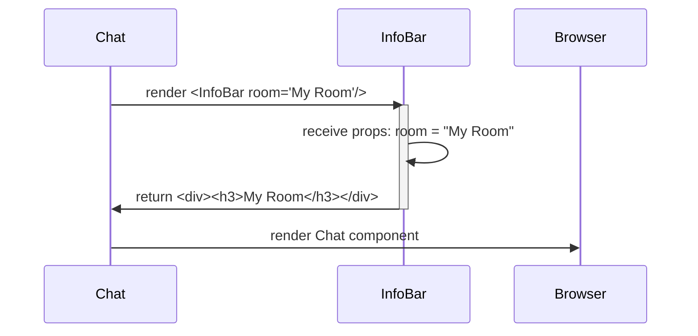

# Chapter 1: React Components

Imagine building a house. You wouldn't just pile bricks on top of each other, would you? You'd use pre-made walls, windows, and doors. React components are like those pre-made parts for building websites! They let us break down a complex website into smaller, reusable pieces.

In our chat application, we have components for different parts of the chat interface: joining a room, displaying messages, and typing messages. This chapter will introduce you to React components and how they help us build our chat app.

### Why Use Components?

Think about building a really, *really* long webpage with the same button repeated 100 times. Without components, you'd have to copy and paste the button's code 100 times! If you wanted to change the button's color, you'd have to change it in 100 different places. That's a nightmare!

React components solve this problem by letting you define a button *once* and then reuse it as many times as you want. If you want to change the button's color, you only have to change it in one place, and all the buttons will update automatically. This makes our code much easier to manage and maintain.

### Key Concepts

Let's look at some key concepts related to React components:

*   **Reusability:** Components can be used multiple times throughout your application.
*   **Composability:** Components can be combined to create more complex UIs. Think of combining LEGO bricks to build a castle.
*   **State:** Components can manage their own data (called "state"), which determines what they display. If a component's state changes, the component automatically updates.
*   **Props:** Components can receive data from their parent components through "props". Think of props as arguments that you pass to a function.

### Components in Our Chat App

Let's see how components are used in our `Socket.io-Chat-Application-master` project. Here are a few key components:

*   **`Join`:** This component handles the form where users enter their name and the chat room they want to join.
*   **`Chat`:** This component is the main chat interface, displaying the messages, the input field, and the online users.
*   **`Input`:** This component is the text input field where users type their messages.
*   **`Messages`:** This component displays the list of messages in the chat.
*   **`InfoBar`:** This component displays the name of the room at the top of the chat.

### Using Components: The `Chat` Component Example

Let's look at the `Chat` component in `src\components\Chat\Chat.js`. This component is responsible for displaying the main chat interface.

```javascript
import React from 'react'
import InfoBar from '../InfoBar/InfoBar';
import Input from '../Input/Input';
import Messages from '../Messages/Messages';
import TextContainer from '../TextContainer/TextContainer';

export default function Chat() {
    return (
        <div>
            <InfoBar room="My Room"/>
            <Messages messages={[]} name="John"/>
            <Input message="" setMessage={()=>{}} sendMessage={()=>{}} />
            <TextContainer users={[]}/>
        </div>
    );
}
```

Here's what's happening:

1.  We import other components: `InfoBar`, `Messages`, `Input`, and `TextContainer`.  These are the building blocks we'll use to construct the `Chat` component.
2.  The `Chat` component returns some HTML-like code (JSX).
3.  Inside the `Chat` component, we *use* the other components we imported. For example, `<InfoBar room="My Room"/>` includes the `InfoBar` component and passes it a `room` prop with the value "My Room".  The `room` prop tells the `InfoBar` component what room name to display.
4.  The `Messages` component receives an empty array as the `messages` prop, meaning no messages are displayed yet.  The `name` prop provides a default name "John".
5.  The `Input` component renders the message input field. The message, setMessage and sendMessage are passed as props which manage the input state.
6.  The `TextContainer` component receives an empty array as the `users` prop, meaning no users are displayed yet.

This is a simple example of how components can be combined to create a more complex UI. The `Chat` component *composes* the other components to display the entire chat interface.

### Internal Implementation: A Simple Component

Let's dive a little deeper and look at the `InfoBar` component in `src\components\InfoBar\InfoBar.js`. This component is responsible for displaying the room name and the close button.

```javascript
import React from 'react'

function InfoBar( { room } ) {
    return (
        <div>
            <h3>{ room }</h3>
        </div>
    )
}

export default InfoBar;
```

Here's a breakdown:

1.  We import `React` because this is a React component! All components need this import.
2.  We define a *function* called `InfoBar`.  This function *is* our component.  React components are often defined as functions.
3.  The `InfoBar` function takes a `room` prop as an argument.  Props are how components receive data from their parent components.
4.  The `InfoBar` function returns some JSX. In this case, it returns a `div` containing an `h3` that displays the `room` prop.

When the `Chat` component uses the `InfoBar` component like this: `<InfoBar room="My Room"/>`, React calls the `InfoBar` function and passes it the `room` prop with the value "My Room". The `InfoBar` component then renders the `h3` element with the text "My Room".

### Visualizing the Process

Here's a simplified sequence diagram showing how the `Chat` and `InfoBar` components interact:



This diagram shows that the `Chat` component tells the `InfoBar` component to render itself with the `room` prop set to "My Room". The `InfoBar` component then returns the HTML to display the room name. Finally, the `Chat` component renders the entire chat interface in the browser.

### Conclusion

React components are fundamental to building user interfaces. They allow us to break down complex UIs into smaller, reusable pieces, making our code easier to manage and maintain. By understanding components, you're well on your way to mastering React!

In the next chapter, we'll explore [Routing (React Router)](02_routing__react_router__.md), which allows us to navigate between different pages or sections of our chat application.


---

Generated by [AI Codebase Knowledge Builder](https://github.com/The-Pocket/Tutorial-Codebase-Knowledge)