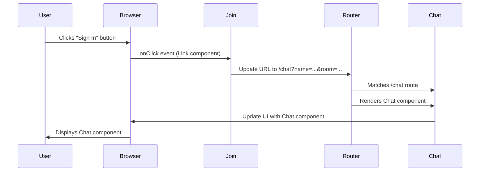

# Chapter 2: Routing (React Router)

In the previous chapter, [React Components](01_react_components_.md), we learned how to break down our chat application into reusable building blocks. Now, let's learn how to navigate between those building blocks!

Imagine you want to switch from the "Join Room" page to the actual "Chat Room" page. How do you do that in a web application built with React? That's where React Router comes in!

React Router helps us handle *routing*, which is essentially directing users to different parts of our application based on the URL in their browser. Think of it like a GPS for your website! It tells the browser which component to display based on the address (URL) the user is visiting.

### What is Routing?

Routing is the process of navigating between different "pages" or views within your web application without requiring a full page reload from the server. Without routing, every click that navigates to a different view would require the browser to request the *entire* page from the server again, which is slow and inefficient.

### Key Concepts of React Router

Here are a few key concepts to understand:

*   **Router:** This is the main component that wraps your entire application and makes routing possible. It listens for changes in the URL and updates the UI accordingly. In our case we are using `BrowserRouter` which is designed for web browsers.
*   **Route:** A `Route` component defines a mapping between a specific URL path (like `/` or `/chat`) and the component that should be rendered when that path is visited. Think of it as a signpost that says, "If you see `/chat`, show the `Chat` component!".
*   **Link:** The `Link` component lets users navigate between different routes by clicking on them. It's like a regular HTML `<a>` tag (an anchor tag), but it prevents the browser from reloading the entire page. It modifies the URL, which then triggers the `Router` to update the displayed component.

### How Routing Works in Our Chat App

In our `Socket.io-Chat-Application-master` project, we use React Router to switch between the `Join` component (where users enter their name and room) and the `Chat` component (where users actually chat).

Let's look at `src\App.js`:

```javascript
import React from 'react';
import { BrowserRouter as Router, Route } from 'react-router-dom';
import Join from './components/Join/Join';
import Chat from './components/Chat/Chat';

const App = () => (
    <Router>
        <Route path="/" exact component={Join} />
        <Route path="/chat" component={Chat} />
    </Router>
);

export default App;
```

Here's what's happening:

1.  We import the necessary components from the `react-router-dom` library: `BrowserRouter` (renamed to `Router`), and `Route`.
2.  We wrap our entire application with the `<Router>` component. This enables routing for the whole app.
3.  We define two `<Route>` components:
    *   `<Route path="/" exact component={Join} />`: This tells React Router that when the user visits the root path `/` (the homepage), it should render the `Join` component. The `exact` prop ensures that this route only matches the *exact* path `/`, and not paths that *start* with `/` (like `/chat`).
    *   `<Route path="/chat" component={Chat} />`: This tells React Router that when the user visits the path `/chat`, it should render the `Chat` component.

So, when a user goes to `http://example.com/`, the `Join` component will be displayed. When they go to `http://example.com/chat`, the `Chat` component will be displayed.

### Using `Link` to Navigate

Now, let's see how the `Join` component uses the `Link` component to navigate to the `Chat` component.

Open `src\components\Join\Join.js`:

```javascript
import React, { useState } from 'react';
import { Link } from 'react-router-dom';
import './Join.css';

function Join() {
    const [name, setName] = useState('');
    const [room, setRoom] = useState('');

    function handleNameEvent(event) {
        setName(event.target.value);
    }
    function handleRoomEvent(event) {
        setRoom(event.target.value);
    }
    

    return (
        <div className="joinOuterContainer">
            {/* ... other code ... */}
            <Link onClick={event => (!name || !room) ? event.preventDefault() : null} to={`/chat?name=${name}&room=${room}`}>
                <button className="button mt-20" type="submit">Sign In</button>
            </Link>
        </div>
    )
}

export default Join
```

Here's what to focus on:

1.  We import the `Link` component from `react-router-dom`.
2.  Inside the `Join` component, we have a `<Link>` component that wraps a `<button>`.
3.  The `to` prop of the `<Link>` component is set to ``/chat?name=${name}&room=${room}``. This specifies the URL to navigate to when the button is clicked. The `?name=${name}&room=${room}` part adds the user's name and room as *query parameters* to the URL. This is how we pass the user's information to the `Chat` component.
4. The `onClick` prevents the navigation if the user doesn't fill in name or room.

When the user clicks the "Sign In" button, the `Link` component will:

1.  Prevent the browser from reloading the entire page.
2.  Update the URL in the browser's address bar to `/chat?name=User'sName&room=RoomName`.
3.  React Router will then see the URL change and render the `Chat` component, passing the name and room as URL parameters.

### Visualizing the Routing Process

Here's a simplified sequence diagram showing how routing works:



This diagram shows that when the user clicks the button, the `Link` component updates the URL, which triggers the `Router` to render the `Chat` component.

### Internal Implementation: How `App.js` Controls Routing

Let's peek under the hood at how `App.js` orchestrates the routing. The key is the `<Router>` and `<Route>` components from `react-router-dom`.

The `BrowserRouter` component in `src\App.js` uses the browser's history API to keep track of the URL. The `Route` components then listen for changes to the URL and render the appropriate component based on the `path` prop.

When the URL changes, `BrowserRouter` notifies all its children, including the `Route` components. Each `Route` component checks if its `path` prop matches the current URL. If it does, it renders the component specified in its `component` prop.

### Conclusion

In this chapter, we've learned how React Router allows us to navigate between different components in our application without full page reloads. We saw how to define routes using the `<Route>` component and how to navigate between routes using the `<Link>` component. We also explored the main use case: navigation between the Join and Chat components.

In the next chapter, [Socket.IO Connection](03_socket_io_connection_.md), we'll dive into the exciting world of real-time communication with Socket.IO and see how to establish a connection between the client and the server.


---

Generated by [AI Codebase Knowledge Builder](https://github.com/The-Pocket/Tutorial-Codebase-Knowledge)