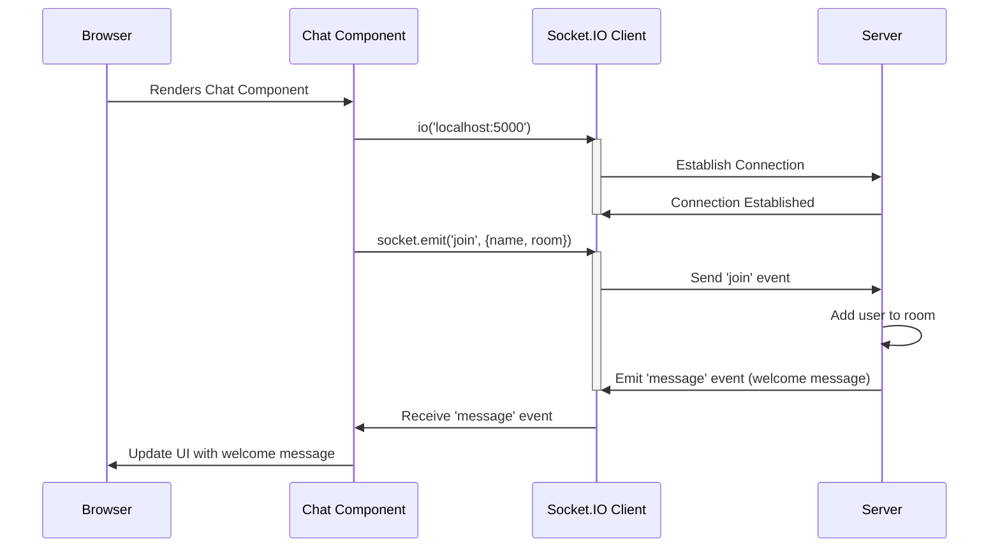

# Chapter 3: Socket.IO Connection

In the previous chapter, [Routing (React Router)](02_routing__react_router__.md), we learned how to navigate between different pages in our chat application. Now, let's make our chat application *real-time*!  This means when someone sends a message, everyone in the chat room sees it *instantly*, without having to refresh the page.

To achieve this, we'll use Socket.IO. Think of Socket.IO as the magic that allows us to create a persistent "telephone line" between the client (your browser) and the server.  Instead of making separate calls every time we want to send or receive a message (like with regular HTTP requests), Socket.IO keeps the line open, allowing instant back-and-forth communication.

### Why do we need Socket.IO?

Imagine a traditional phone call. You dial a number, the call connects, you talk, and then you hang up. Each time you want to say something, you have to dial the number again. That's how regular web requests work (HTTP requests).

Now, imagine a walkie-talkie. You turn it on, and you're instantly connected. You can talk, the other person can talk, and you don't have to keep reconnecting. Socket.IO is like a walkie-talkie for web applications. It allows for a persistent connection for real-time communication!

### Key Concepts of Socket.IO

Here are the key concepts you'll need to understand:

*   **Connection:** This is the process of establishing the "telephone line" between the client and the server.
*   **Socket:**  Think of a socket as *one end* of the "telephone line." Both the client and the server have a socket. It is the main tool to send and receive messages.
*   **Emit:** This is like *speaking* into the walkie-talkie.  You *emit* a message from one socket, and it gets sent to the other socket.
*   **On:** This is like *listening* to the walkie-talkie.  You *listen* on a socket for incoming messages.

### Connecting to the Server

Let's see how we establish a Socket.IO connection in our chat application. This happens in `src\components\Chat\Chat.js`.

```javascript
import io from "socket.io-client";

let socket; // We declare it here, so other useEffects can also access it.

export default function Chat({ location }) {
    const ENDPOINT = 'localhost:5000';

    useEffect(() => {
        socket = io(ENDPOINT);
    }, [ENDPOINT]); // Only run this effect when ENDPOINT changes.
}
```

Here's what's happening:

1.  We import the `socket.io-client` library.  This library provides the `io()` function, which we use to create a new socket connection.
2.  We declare a `socket` variable with `let` outside of the `useEffect` block so it can be accessed in other `useEffect` blocks.
3.  We use the `useEffect` hook to run this code only *once* when the `Chat` component first loads.
4.  Inside the `useEffect` hook, we call `io(ENDPOINT)` to establish a connection with the server. `ENDPOINT` is set to `localhost:5000`, which is where our server is running.
5. The `[ENDPOINT]` in the `useEffect` hook ensures that this effect only runs when the `ENDPOINT` variable changes. In this case, it will run only once, on component mount.

This code creates the "telephone line" from your browser to the chat server! The `socket` variable now holds our connection, and we can use it to send and receive messages.

### Joining a Chat Room

After establishing the connection, we need to tell the server which chat room the user wants to join.

```javascript
useEffect(() => {
    const { name, room } = queryString.parse(location.search);

    socket.emit('join', { name, room }, (error) => {
        if(error) {
            alert(error);
        }
    });
}, [ENDPOINT, location.search]);
```

Here's the breakdown:

1.  We use `queryString.parse(location.search)` to extract the `name` and `room` from the URL. Remember [Chapter 2: Routing (React Router)](02_routing__react_router__.md)? We passed the name and room as URL parameters.
2.  We use `socket.emit('join', { name, room }, (error) => { ... });` to send a `join` event to the server, along with the user's `name` and `room`.
3.  The `(error) => { ... }` part is a *callback function*.  The server will call this function if there is an error when joining the room. If there's an error, we display an alert to the user.
4. The `[ENDPOINT, location.search]` makes sure this effect only runs when `ENDPOINT` or `location.search` changes.

Think of this as telling the server, "Hey, this user wants to join this specific chat room!"  The `emit` function is how we send information from the client to the server.

On the server side, the server listens for the `join` event.  Let's look at the relevant code in `server\index.js`:

```javascript
io.on('connect', (socket) => {
    socket.on('join', ({ name, room }, callback) => {
        // ... (code to add user to room) ...
    });
});
```

1.  `io.on('connect', (socket) => { ... });` sets up a listener for new client connections.  Whenever a client connects, the code inside the curly braces will run. The `socket` argument represents the connection with *that specific client*.
2.  `socket.on('join', ({ name, room }, callback) => { ... });` sets up a listener for the `join` event *on that specific client's socket*.  Whenever the client emits a `join` event, this code will run.
3.  The `({ name, room }, callback) => { ... });` part extracts the `name` and `room` data that was sent from the client.

The server then adds the user to the specified room and sends a welcome message. The callback allows the server to acknowledge to the client.

### Receiving Messages

Now, let's see how we *receive* messages from the server. This also happens in `src\components\Chat\Chat.js`.

```javascript
useEffect(() => {
    socket.on('message', (message) => {
        setMessages(messages => [...messages, message]);
    });

    socket.on('roomData', ({ users }) => {
        setUsers(users);
    });
}, []);
```

Here's the breakdown:

1.  We use `socket.on('message', (message) => { ... });` to listen for `message` events from the server. Whenever the server emits a `message` event, this code will run.
2.  The `(message) => { ... }` part extracts the `message` data that was sent from the server.
3.  `setMessages(messages => [...messages, message]);` updates the `messages` state with the new message. This causes the `Messages` component (from [Chapter 1: React Components](01_react_components_.md)) to re-render and display the new message.
4.  `socket.on('roomData', ({ users }) => { ... });` listens for `roomData` events and updates the `users` state.

This code is like constantly *listening* for new messages from the server! When a new message arrives, we add it to the list of messages and display it in the chat.

On the server side, the server emits the `message` event whenever someone sends a message. Let's look at `server\index.js` again:

```javascript
socket.on('sendMessage', (message, callback) => {
    const user = getUser(socket.id);

    io.to(user.room).emit('message', { user: user.name, text: message });

    callback();
  });
```

1.  `socket.on('sendMessage', (message, callback) => { ... });` listens for the `sendMessage` event from a specific client.
2.  `io.to(user.room).emit('message', { user: user.name, text: message });` sends a `message` event to *all* clients in the specified room.  This ensures that everyone in the room receives the message. The `io.to(user.room)` part makes sure that the message is only sent to clients in the correct room.

The callback allows the server to acknowledge to the client.

### Visualizing the Connection Process

Here's a simplified sequence diagram showing how the Socket.IO connection is established:



### Internal Implementation: Under the Hood

The `socket.io-client` library handles the complexities of establishing and maintaining the connection with the server. It tries different transport methods (like WebSockets or HTTP long-polling) to find the most reliable way to communicate.

On the server side, the `socket.io` library handles managing the connections, routing messages to the correct clients, and handling disconnections. The underlying transport is handled automatically.

### Conclusion

In this chapter, we've learned how to establish a Socket.IO connection between the client and the server, how to join a chat room, and how to send and receive messages. This is the foundation for building a real-time chat application!

In the next chapter, [Message Handling (Server and Client)](04_message_handling__server_and_client__.md), we'll dive deeper into how messages are sent and received between the server and the client.


---

Generated by [AI Codebase Knowledge Builder](https://github.com/The-Pocket/Tutorial-Codebase-Knowledge)