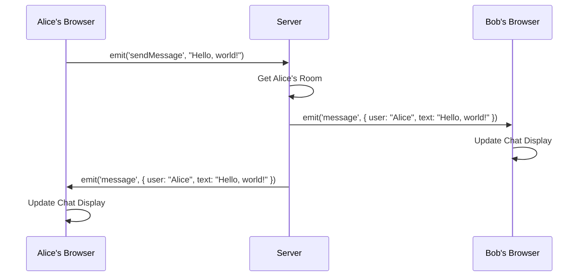

# Chapter 4: Message Handling (Server and Client)

In the previous chapter, [Socket.IO Connection](03_socket_io_connection_.md), we set up the "telephone line" that lets our chat application communicate in real-time. Now, let's learn how to actually *talk* on that line – how to send and receive messages between users!

Imagine two friends using walkie-talkies. One friend speaks into the walkie-talkie (sends a message), and the other friend hears the message (receives a message). This chapter will explain how our chat application simulates this process.

### The Problem: Real-Time Chatting

The core problem we're solving is how to let users send messages to each other in real-time. When Alice sends a message in the chat room, Bob (and everyone else in the room) should see it instantly. We need a reliable system for sending messages *from* the client (Alice's browser) *to* the server and *from* the server *to* all other connected clients (Bob's browser).

### Key Concepts: `sendMessage` and `message` Events

Our chat application uses two main events for message handling:

*   **`sendMessage`:** This is the event the *client* emits (sends) to the server when a user types and sends a message. Think of it as Alice pressing the "talk" button on her walkie-talkie and speaking.
*   **`message`:** This is the event the *server* emits (sends) to all connected clients in the room when it receives a message. Think of it as the server broadcasting Alice's message to everyone else listening on the channel (the chat room).

### Sending a Message from the Client

Let's look at the code in `src\components\Chat\Chat.js` that handles sending a message:

```javascript
const sendMessage = (event) => {
    event.preventDefault();

    if(message){
        socket.emit('sendMessage', message, () => setMessage(''));
    } 
}
```

Here's what's happening:

1.  `event.preventDefault();`: This prevents the browser from refreshing the page when the user submits the form.  We don't want the page to reload, because that would interrupt the real-time chat!
2.  `if(message){ ... }`: We only send the message if the `message` input isn't empty.
3.  `socket.emit('sendMessage', message, () => setMessage(''));`: This is the crucial part. We're using the `socket` object (which represents our connection to the server) to `emit` a `sendMessage` event. We're sending the actual `message` that the user typed as data along with the event. The `() => setMessage('')` part is a callback function that clears the input field after the message is sent. This is optional, but provides for a better user experience.

So, when a user types "Hello, world!" and hits send, this code sends a `sendMessage` event to the server, along with the text "Hello, world!".

### Receiving a Message on the Server

Now, let's look at the server-side code in `server\index.js` that handles receiving the `sendMessage` event:

```javascript
socket.on('sendMessage', (message, callback) => {
    const user = getUser(socket.id);

    io.to(user.room).emit('message', { user: user.name, text: message });

    callback();
});
```

Here's what's happening:

1.  `socket.on('sendMessage', (message, callback) => { ... });`: This sets up a listener on the server that listens for the `sendMessage` event from a specific client's socket.
2.  `const user = getUser(socket.id);`: This retrieves the user's information (including their name and room) based on their socket ID.
3.  `io.to(user.room).emit('message', { user: user.name, text: message });`: This is where the magic happens! The server emits a *new* event called `message` to *all* clients in the user's room (`user.room`). The data sent with this event is an object containing the sender's `user.name` and the `text` of the `message`. The `io.to(user.room)` part ensures the message is only sent to people in the same room.
4.  `callback();`: This optional callback acknowledges to the client that the message was received.

So, when the server receives the `sendMessage` event, it takes the message and sends it back out to *everyone* in the chat room as a `message` event.

### Receiving a Message on the Client

Finally, let's look at the client-side code in `src\components\Chat\Chat.js` that handles receiving the `message` event:

```javascript
useEffect(() => {
    socket.on('message', (message) => {
        setMessages(messages => [...messages, message]);
    });
}, []);
```

Here's what's happening:

1.  `socket.on('message', (message) => { ... });`: This sets up a listener on the client that listens for the `message` event from the server.
2.  `setMessages(messages => [...messages, message]);`: This updates the `messages` state with the new `message`. The `setMessages` function comes from the `useState` hook (look for `const [messages, setMessages] = useState([]);` in the `Chat.js` file).  The `...messages` part creates a new array containing all the previous messages plus the new `message`.  This triggers a re-render of the `Messages` component (from [Chapter 1: React Components](01_react_components_.md)), which then displays the new message on the screen.

So, when the client receives the `message` event from the server, it adds the message to its list of messages and updates the chat interface.

### Visualizing the Message Flow

Here's a sequence diagram showing how the `sendMessage` and `message` events work together:



This diagram shows that when Alice sends a message, it goes to the server, which then broadcasts the message to everyone in the room, including Bob and Alice herself. Each client then updates their chat interface to display the new message.

### Internal Implementation: How Socket.IO Works

When `socket.emit('sendMessage', message)` is called on the client, the `socket.io-client` library packages the `sendMessage` event and the `message` data into a special format and sends it to the server over the established Socket.IO connection.

On the server side, the `socket.io` library receives the data, unpacks it, and then triggers the corresponding `socket.on('sendMessage', ...)` handler. Inside the handler, `io.to(user.room).emit('message', ...)` uses Socket.IO's built-in features to efficiently send the `message` event to all clients in the specified room. Socket.IO manages the complexity of ensuring that the message is delivered reliably and quickly to all connected clients. The server then sends the message out using websockets.

### Conclusion

In this chapter, we've learned how messages are sent and received between the client and the server using the `sendMessage` and `message` events. We've seen how the client emits the `sendMessage` event, how the server receives it and broadcasts a `message` event to all clients in the room, and how the clients then receive the `message` event and update their chat interfaces.

In the next chapter, [User Management (Server-Side)](05_user_management__server_side__.md), we'll dive into how the server manages users and keeps track of who's in which chat room.


---

Generated by [AI Codebase Knowledge Builder](https://github.com/The-Pocket/Tutorial-Codebase-Knowledge)