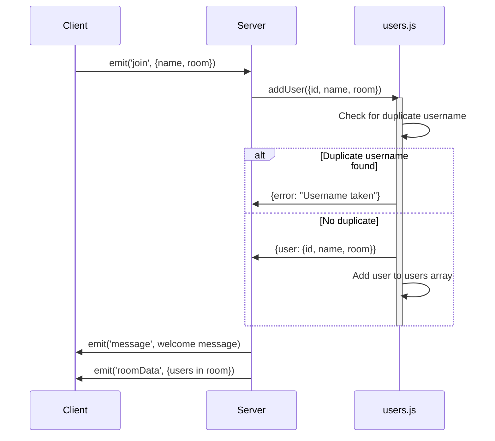

# Chapter 5: User Management (Server-Side)

In the previous chapter, [Message Handling (Server and Client)](04_message_handling__server_and_client__.md), we learned how to send and receive messages in our chat application. But how does the *server* know who's in which chat room? How does it prevent two people from using the same username in the same room? That's where user management comes in!

Think of the server as a club, and each chat room as a separate room inside the club. We need a bouncer (the server-side code) to keep track of who's allowed in each room, to prevent overcrowding, and to make sure everyone has a unique name tag. This chapter focuses on how the server manages the user list, essentially acting as that bouncer.

### The Problem: Keeping Track of Users

Let's say Alice joins the "JavaScript Fanatics" chat room with the username "Alice". Then, Bob tries to join the same room, *also* with the username "Alice". We can't have two "Alices" in the same room – it would be confusing!

We need the server to:

1.  **Add users:** When someone joins a room, add them to the user list for that room.
2.  **Remove users:** When someone leaves a room, remove them from the user list.
3.  **Check for duplicates:** Prevent users from joining a room with a username that's already taken.
4.  **Get user information:** Given a user's unique ID (assigned by Socket.IO), retrieve their name and room.
5.  **List users in a room:** Get a list of all users currently in a specific room.

### Key Concepts: The `users.js` File

All of this user management magic happens in the `server\users.js` file. This file acts like a simple database for storing user information. It's not a real database (like MySQL or MongoDB), but it serves the purpose for our simple chat application.

Here are the key functions in `users.js`:

*   **`addUser`:** Adds a new user to a room.
*   **`removeUser`:** Removes a user from a room.
*   **`getUser`:** Retrieves a user's information.
*   **`getUsersInRoom`:** Retrieves a list of users in a room.

Let's look at each of these functions in more detail.

### Adding a User (`addUser`)

The `addUser` function is responsible for adding a new user to the `users` array. It also checks for duplicate usernames.

```javascript
const users = []; // This stores the array of users.

const addUser = ({ id, name, room }) => {
    // Clean up the data
    name = name.trim().toLowerCase();
    room = room.trim().toLowerCase();

    // Check if username exists in the room already
    const existingUser = users.find((user) => user.room === room && user.name === name);

    // Prevent user from joining with same username
    if(existingUser) {
        return { error: 'Username is taken'};
    }

    const user = { id, name, room };
    
    users.push(user);

    return { user };
}
```

Here's what the code does:

1.  **`name = name.trim().toLowerCase();` and `room = room.trim().toLowerCase();`:** Cleans up the username and room name. `.trim()` removes whitespace, and `.toLowerCase()` converts everything to lowercase to avoid case-sensitivity issues.
2.  **`const existingUser = users.find((user) => user.room === room && user.name === name);`:** Checks if a user with the same name already exists in the same room.
3.  **`if(existingUser) { return { error: 'Username is taken'}; }`:** If a duplicate username is found, it returns an error object.
4.  **`const user = { id, name, room };`:** Creates a new user object with the provided information.
5.  **`users.push(user);`:** Adds the new user to the `users` array.
6.  **`return { user };`:** Returns the newly created user object.

**Example:**

Input: `addUser({ id: '123', name: '  Alice ', room: 'JavaScript Fanatics ' })`

Output: `{ user: { id: '123', name: 'alice', room: 'javascript fanatics' } }` and the user is added to the `users` array.
If a user with the name `alice` is already in `javascript fanatics`, then returns `{ error: 'Username is taken' }`

### Removing a User (`removeUser`)

The `removeUser` function is responsible for removing a user from the `users` array when they disconnect.

```javascript
const removeUser = (id) => {
    const index = users.findIndex((user) => user.id === id);

    if(index !== -1) {
        return users.splice(index, 1)[0];
    }
}
```

Here's what the code does:

1.  **`const index = users.findIndex((user) => user.id === id);`:** Finds the index of the user in the `users` array based on their `id`.
2.  **`if(index !== -1) { return users.splice(index, 1)[0]; }`:** If the user is found (index is not -1), it removes them from the array using `splice` and returns the removed user.

**Example:**

Input: `removeUser('123')`

If a user with id '123' exists, then the user with the id '123' will be removed from `users` array, and it will return the removed user. If the user does not exist, it returns `undefined`.

### Getting a User (`getUser`)

The `getUser` function retrieves a user's information based on their `id`.

```javascript
const getUser = (id) => users.find((user) => user.id === id);
```

This function simply uses the `find` method to search the `users` array for a user with the matching `id` and returns the user object.

**Example:**

Input: `getUser('123')`

Output: `{ id: '123', name: 'alice', room: 'javascript fanatics' }` if such user exists. Otherwise, `undefined`.

### Getting Users in a Room (`getUsersInRoom`)

The `getUsersInRoom` function retrieves a list of all users in a specific room.

```javascript
const getUsersInRoom = (room) => users.filter((user) => user.room === room);
```

This function uses the `filter` method to create a new array containing only the users who are in the specified `room`.

**Example:**

Input: `getUsersInRoom('javascript fanatics')`

Output: `[{ id: '123', name: 'alice', room: 'javascript fanatics' }, { id: '456', name: 'bob', room: 'javascript fanatics' }]` if those two users are in the `javascript fanatics` room.

### How it all Works Together: A Sequence Diagram

Here's a simplified sequence diagram showing how these functions are used when a user joins a chat room:



### Internal Implementation: `server\index.js` Integration

Now, let's see how these functions from `users.js` are used in the main server file, `server\index.js`.

First, let's look at how the server handles the `join` event:

```javascript
const { addUser, removeUser, getUser, getUsersInRoom } = require('./users');

io.on('connect', (socket) => {
    socket.on('join', ({ name, room }, callback) => {
        const { error, user } = addUser({ id: socket.id, name, room });

        if(error) return callback(error);

        socket.join(user.room);

        // ... (rest of the code) ...
    });
});
```

Here's what's happening:

1.  **`const { addUser, removeUser, getUser, getUsersInRoom } = require('./users');`:** Imports the user management functions from `users.js`.
2.  **`const { error, user } = addUser({ id: socket.id, name, room });`:** Calls the `addUser` function to add the new user. The `id` is the unique socket ID assigned by Socket.IO.
3.  **`if(error) return callback(error);`:** Checks if there was an error (duplicate username). If so, it calls the callback function with the error message, which is then displayed to the user on the client-side (check [Chapter 3: Socket.IO Connection](03_socket_io_connection_.md) to know more about callback usage).
4.  **`socket.join(user.room);`:** If the user was successfully added, it joins them to the specified chat room.

Next, let's look at how the server handles the `disconnect` event:

```javascript
io.on('connect', (socket) => {
    socket.on('disconnect', () => {
        const user = removeUser(socket.id);

        if(user) {
            // ... (rest of the code) ...
        }
    });
});
```

Here's what's happening:

1.  **`const user = removeUser(socket.id);`:** Calls the `removeUser` function to remove the user from the `users` array when they disconnect.
2.  **`if(user) { ... }`:** If a user was successfully removed (meaning they were previously connected), it broadcasts a message to the room that they have left.

### Conclusion

In this chapter, we've learned how the server manages users using the `users.js` file. We've seen how to add users, remove users, check for duplicates, and retrieve user information. This is crucial for building a robust and user-friendly chat application. The simple data structure here offers a foundation for persistence via full database solutions such as MySQL or MongoDB.

In the next chapter, we may improve the app's features or user interface to enhance user engagement. Alternatively, we could dive deeper into testing strategies to ensure our app is rock-solid and bug-free.


---

Generated by [AI Codebase Knowledge Builder](https://github.com/The-Pocket/Tutorial-Codebase-Knowledge)