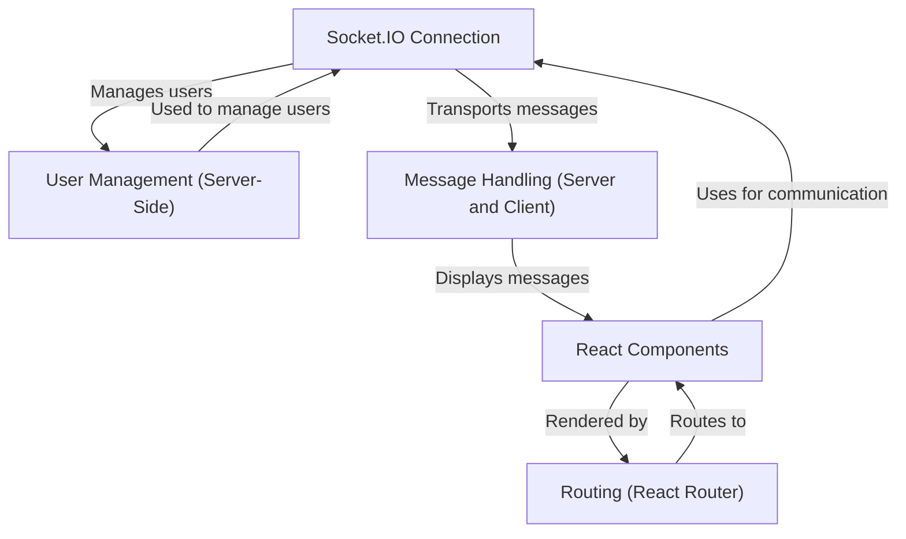

# Tutorial: Socket.io-Chat-Application-master

This project is a real-time chat application built using **Socket.IO**, *React*, Node.js, and Express. Users can join chat rooms and send messages to each other instantly. The application handles user management, routing, and displays messages in a user-friendly interface.

**Source Repository:** [None](None)

## Chapters

1. [React Components
](01_react_components_.md)
2. [Routing (React Router)
](02_routing__react_router__.md)
3. [Socket.IO Connection
](03_socket_io_connection_.md)
4. [Message Handling (Server and Client)
](04_message_handling__server_and_client__.md)
5. [User Management (Server-Side)
](05_user_management__server_side__.md)

---

Generated by [AI Codebase Knowledge Builder](https://github.com/The-Pocket/Tutorial-Codebase-Knowledge)
